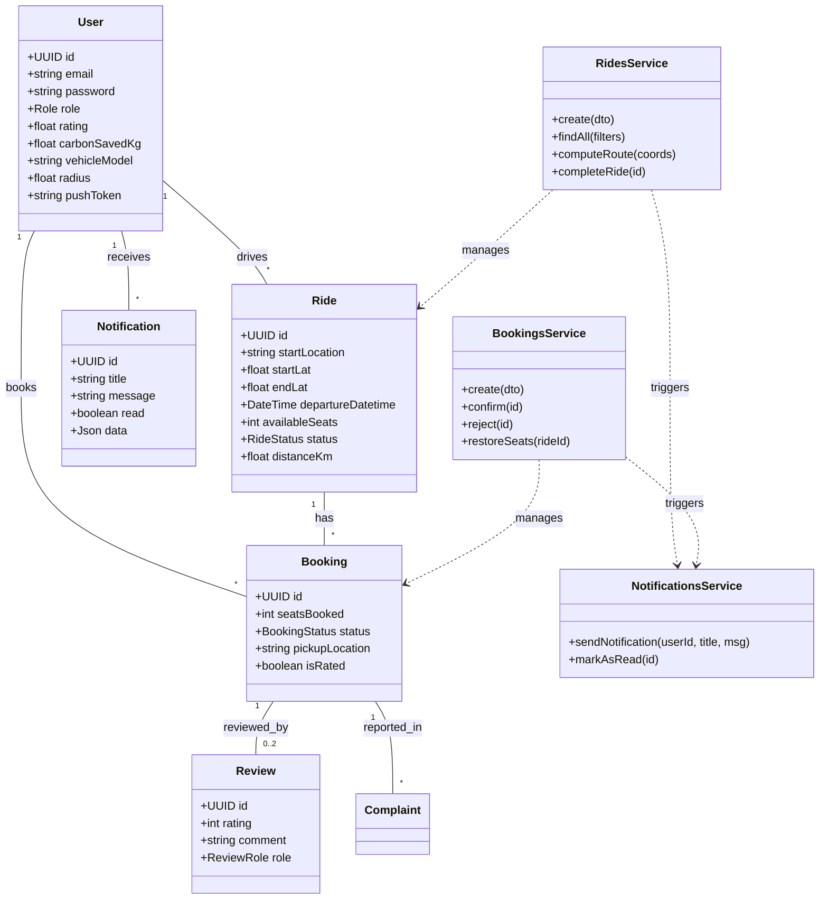

# RideMate Architecture Diagrams

This file contains the system diagrams for RideMate. You can visualize these directly in VS Code (with the Mermaid extension), on GitHub, or by pasting the code into the [Mermaid Live Editor](https://mermaid.live/).

## 1. Use Case Diagram
Illustrates the interactions between users (Guests, Drivers, Passengers) and the system features.

```mermaid
useCaseDiagram
    actor "Guest" as G
    actor "User" as U
    actor "Passenger" as P
    actor "Driver" as D
    actor "System" as S

    U <|-- P
    U <|-- D

    package "Auth & Profile" {
        G --> (Register)
        G --> (Login)
        U --> (Manage Profile & Vehicle)
        U --> (Token Refresh)
    }

    package "Ride Management" {
        D --> (Offer Ride)
        (Offer Ride) ..> (Compute Route & Distance) : <<include>>
        D --> (Complete Ride)
        D --> (Cancel Ride)
        P --> (Search Rides by Radius/City)
    }

    package "Booking Lifecycle" {
        P --> (Request Booking)
        D --> (Confirm/Reject Booking)
        P --> (Cancel Booking)
        S --> (Restore Seats on Cancel) : <<trigger>>
    }

    package "Feedback & Safety" {
        U --> (Post Review)
        (Post Review) ..> (Update User Avg Rating) : <<include>>
        U --> (File Complaint)
        U --> (View Notifications)
    }

    package "Automated Services" {
        S --> (Send Push Notifications)
        (Compute Route & Distance) -- S
    }
```

## 2. Class Diagram
Represents the data models (Prisma) and the backend service logic (NestJS).


